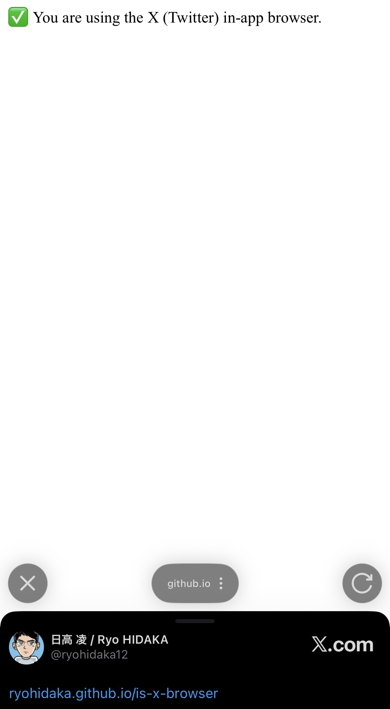
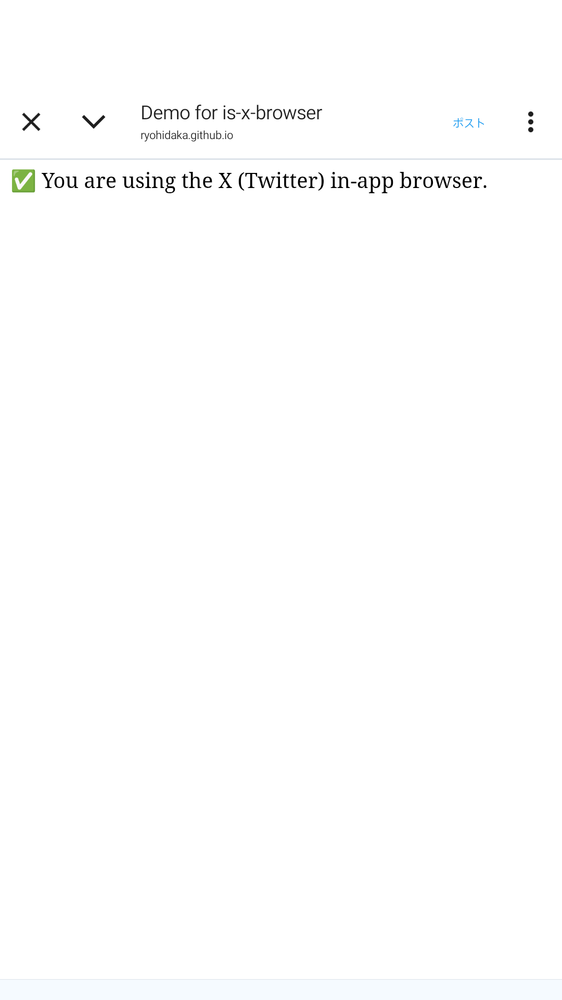
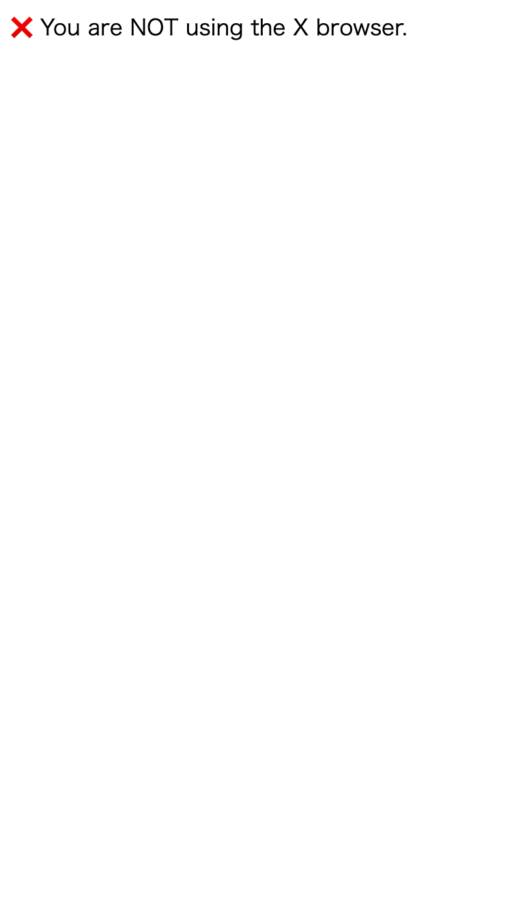

# is-x-browser

[](https://github.com/ryohidaka/is-x-browser/actions/workflows/ci.yml)
[](https://opensource.org/licenses/MIT)

JavaScript library to detect if it's an X In-app browser

## Installation

```bash
npm i is-x-browser
```

## Usage

```typescript
import isXBrowser from 'is-x-browser';

if (isXBrowser()) {
	console.log('Inside X browser');
} else {
	console.log('Regular browser');
}
```

## Demo

* [Demo](https://ryohidaka.github.io/is-x-browser/)

| iOS App                                      | Android App                                      | Browser                                     |
| -------------------------------------------- | ------------------------------------------------ | ------------------------------------------- |
|  |  |  |

## Contributing

Please see [CONTRIBUTING.md](./CONTRIBUTING.md) for contribution guidelines.

## License

MIT
